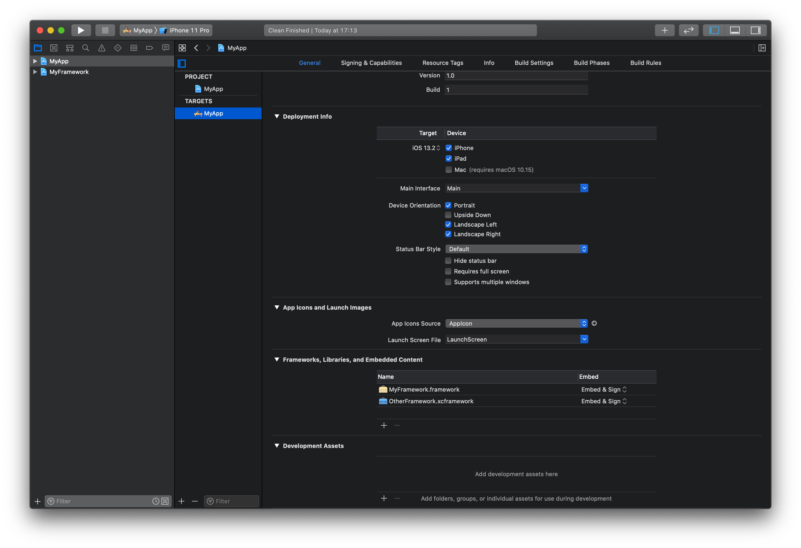
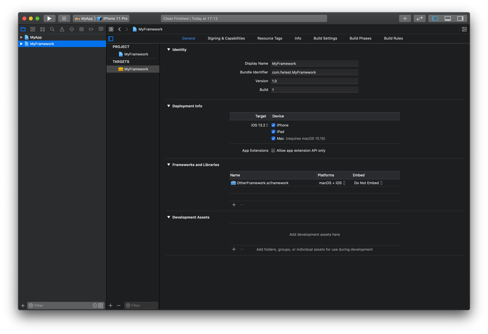
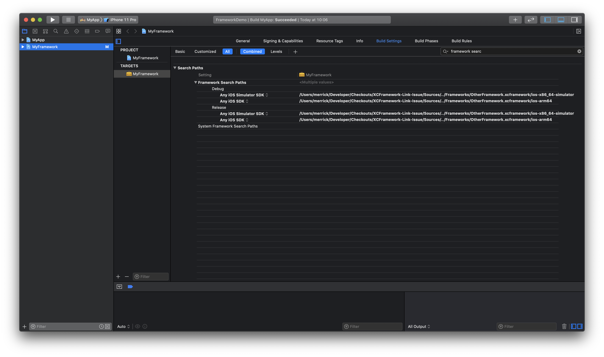

## Issue

When integrating an `xcframework` Framework into an Xcode workspace with a framework target which is dependent on the `xcframework` and then an application target which is dependent on the workspace framework, the application fails to build with a `No such module` error in the workspace framework.

The demo project in this repository has the following structure:

- Xcode Workspace
    - `MyApp` (iOS App target)
    - `MyFramework` (Framework target)
        - `OtherFramework.xcframework` (Pre-compiled `xcframework` that `MyFramework` depends on.)

The frameworks are linked as follows:
- `MyApp`
    - `MyFramework` (Embed & Sign)
    - `OtherFramework.xcframework` (Embed & Sign)
- `MyFramework`
    - `OtherFramework.xcframework` (Do Not Embed)

*Framework Search Paths are correctly configured as `$(SRCROOT)/../Frameworks`*.

**MyApp Project**

     

**MyFramework Project**

     

## Observations
- Building the `MyFramework` scheme works absolutely fine.
- Building the `MyApp` scheme causes the `MyFramework` build to fail with a `No such module 'OtherFramework'` error.
- Removing the `OtherFramework` framework from the `MyApp` target allows the project to build successfully for the Simulator, but this fails on device as `OtherFramework` is not loaded.
- This build failure seems to disappear on the first build on a clean system (i.e. on CI this issue only seems to sporadically occur).
- Integrating normal `.framework` frameworks in this exact manner works fine.

---

## Why this happens

As written by [pyckamil](https://github.com/pyckamil) in [this article](https://pyckamil.github.io/programming,/xcframework,/xcode/2020/05/09/everything-wrong-with-xcframeworks.html?utm_campaign=iOS%2BDev%2BWeekly&utm_medium=email&utm_source=iOS%2BDev%2BWeekly%2BIssue%2B456) this issue is caused by the `ProcessXCFrameworkLibrary` step which extracts the `.framework` from an `.xcframework` for the active build architecture. Xcode only runs this once for an `xcframework` and does not use `FRAMEWORK_SEARCH_PATHS` causing the framework to potentially not be found in a second target.

## Workarounds

### Explicit Architecture Framework Search Paths
It is possible to ensure that the framework target (in this case `MyFramework`) can find `OtherFramework` by explicitly adding a framework search path to the architecture-specific `.framework` within `OtherFramework.xcframework`:

     

Suggested in [#2](https://github.com/msaps/XCFramework-Link-Issue/pull/2) by [shinsuk](https://github.com/shinsuk)

### Recurive Framework Search Paths
A workaround that potentially works is to make the search path for your framework recursive in `FRAMEWORK_SEARCH_PATHS`, but this also has its own issues - suggested in [#1](https://github.com/msaps/XCFramework-Link-Issue/pull/1) by [dipidoo](https://github.com/dipidoo)